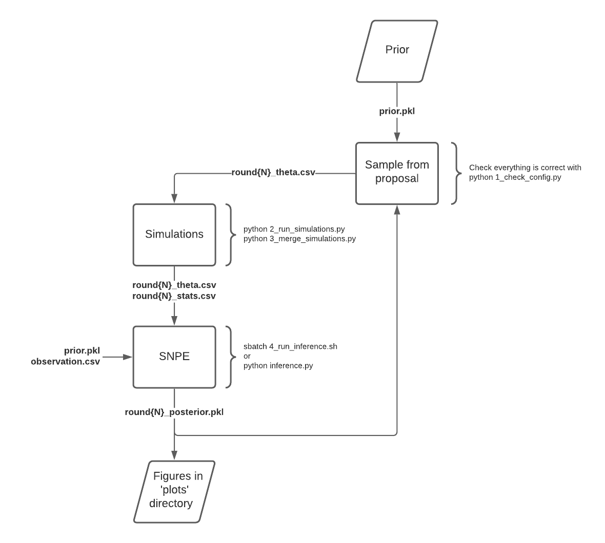

## How to use the scripts for inference

This flowchart shows when the relevant scripts should be run, and which files are created by each step. The whole process can be run on BlueCrystal phase 4.  

Place the observation which the network will be trained for in the location specified by `observation_file="..."` in `inference/config.py`. I have left a sample observation there as an example.

Before starting each round of SNPE, you should update the contents of `inference/config.py` so that the correct files are used. This should just involve incrementing all the round numbers, and changing the proposal to the posterior of the previous round.  

Following this, check that the files and directories are okay by running the `1_check_config.py` script.  

Next, the `2_run_simulations.py` script will run all the simulations, and `3_merge_simulations.py` will combine them into one single file of statistics.  

Running `inference.py` (`4_run_inference.sh` can be used to run this as a job on BlueCrystal) will now create the posterior and dump it to the .pkl file.
